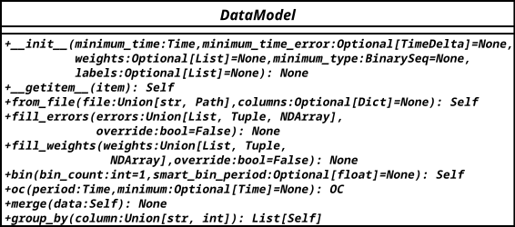

# Yardım

## Ortamın hazırlanması

## Kodu klonlama

```bash
git clone https://github.com/mshemuni/oc_py.git; cd oc_py
```

## Python venv
Sanal çevre oluşturmak için:
```bash
python -m venv .venv
```

Sanal çevreyi yüklemek için:
```bash
source .venv/bin/activate
```
sanal çevre yüklendiğinde prompt'un başında `(.venv)` gibi bir işaret görünür.

Son olarak ocpy'ı düzenlenebiilir olarak kur:
```bash
pip install -e .
```


## Abstract Sınıf (Soyut Sınıf) Nedir?

### Temel Kavramlar

* **Abstract sınıf**, en az bir tane **abstract method** (soyut metot) içeren ve doğrudan örneklenemeyen sınıftır.
* İçindeki abstract methodlar, **alt sınıflar tarafından mutlaka geçersiz kılınmalı (override edilmelidir)**.
* Amaç: Ortak davranışları zorunlu kılarak kodun tutarlılığını ve standart yapısını korumaktır.

---

### Python’da Abstract Sınıf Nasıl Oluşturulur?

Python’da abstract sınıflar için `abc` modülü kullanılır:

```python
from abc import ABC, abstractmethod

class Arac(ABC):
    @abstractmethod
    def ses_cikar(self):
        pass

class Otomobil(Arac):
    def ses_cikar(self):
        print("Bip")

class Kamyon(Arac):
    def ses_cikar(self):
        print("Dat")

# Abstract sınıftan doğrudan nesne yaratmak mümkün değildir:
# a = Arac()  # Bu satır hata verir

otomobil = Otomobil()
otomobil.ses_cikar()  # Çıktı: Bip

kamyon = Kamyon()
kamyon.ses_cikar()  # Çıktı: Dat
```

---

### Özet

* Abstract sınıf, `ABC` sınıfından türetilir.
* Soyut metotlar, `@abstractmethod` dekoratörü ile tanımlanır.
* Alt sınıflar bu soyut metotları mutlaka tanımlamak zorundadır.
* Abstract sınıftan doğrudan nesne oluşturulamaz.

---

## Data Sınıfı ve Abstract Modeli



### Genel Bakış

Data sınıfına bakıldığında aşırı bir yük bindirildiğini görüyoruz.

Bunun en güzel örneği binning metodu olsa gerek. Bu metoddan beklenen bir binning işlemi yapmasıdır. Fakat yaptığı
işler:

- İhtiyaç durumunda Belirli bir zaman aralığında bining işlemi yapmak
- İhtiyaç durumunda Grafiklemek
- İhtiyaç durumunda gruplama işlemi
- İhtiyaç durumunda smart binning yapması

Bu sorumlulukların bir kısmı ayrı metodlara bölünerek daha temiz ve yönetilebilir hale getirilebilir.

Örneğin, **gruplama** ve **sınırlandırma (filtering)** işlemleri `__getitem__` metodu ile sağlanabilir. Eğer kendi `Data` sınıfımızda `pandas` ve `QTable`’daki gibi slicing ve masking özelliklerini uygulayabilirsek, `binning` fonksiyonunu çok daha sade ve esnek yazabiliriz.

---

### Örnek Kullanım

Aşağıdaki örnek, [data\_example.py](src/ocpy/data_example.py) dosyasındaki `DataExample` sınıfı temel alınarak hazırlanmıştır:

```python
from random import random, choices

import numpy as np

from ocpy import DataExample
from astropy.time import Time, TimeDelta

# Sample data
t = Time([i for i in np.linspace(2460898, 2460899, 100)], format='jd')
td = TimeDelta([random() * 0.01 for _ in range(100)], format="jd")
labels = choices(["CCD", "Plate"], k=100)
maximum_error = TimeDelta(0.005, format="jd")

data = DataExample(t, minimum_time_error=td, labels=labels)

filtered_data = data[(data["labels"] == "CCD") & (data["minimum_time_error"] < maximum_error)]
filtered_data.bin()

first_data = data[0]
first_data.bin()

last_data = data[-1]
last_data.bin()

even_data = data[0::2]
even_data.bin()

odd_data = data[1::2]
odd_data.bin()

```

Bu örnekle sadece "CCD" etiketine sahip ve zaman hatası 0.005 günden küçük olan veriler üzerinde binning yapılmış olur.
